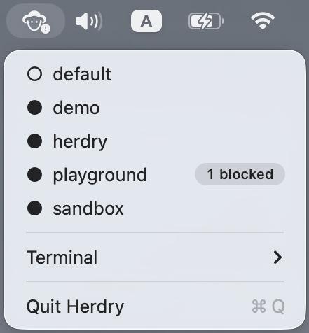

# Herdry

> Jump into your Herdr sessions from the macOS menu bar.

🚧 Experimental / heavy-rocky-development

Herdry is a small macOS menu-bar companion for Herdr.

It helps you:

- see when an agent is blocked and needs your attention
- jump directly into the relevant Herdr session
- avoid manually checking every session

Herdry is intentionally not an agent dashboard. It surfaces attention for
routing.

## Supported terminals

### Alacritty

- Vanilla Alacritty: opens a new window attached to the selected Herdr session
- Alacritty with `find-window` / `focus-window`: reuses an existing
  Herdry-controlled window when available

### iTerm2

- Finds and focuses existing Herdry-managed iTerm2 sessions
- Creates one when missing
- Requires one-time macOS Automation permission
- Uses iTerm2's AppleScript API for now

## Requirements

- macOS
- Herdr installed
- Alacritty or iTerm2

## Installation

The first packaged release is coming soon.

## Status

Herdry is being actively dogfooded by a small number of users. Expect rough
edges and behavioral changes.

Feedback is welcome in GitHub Discussions.

## Project philosophy

Herdry should not show status for observation. It should show attention for
routing.

## Disclaimer

Herdry is an unofficial companion project and is not affiliated with or
maintained by the Herdr project.
